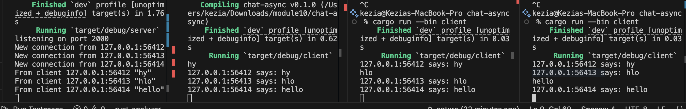
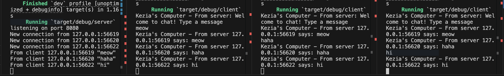

# Kezia Salsalina Agtyra Sebayang - 2306172086

### Experiment 2.1

When I start the server, it binds to 127.0.0.1:2000 and prints a “listening on port 2000” message. Opening each client causes the server to log a “New connection from …” line with the client’s ephemeral port. Behind the scenes, every handler clones the same broadcast channel, so each client gets its own receiver that stays in sync. As soon as one client sends a text message, the server prepends the sender’s address (e.g. 127.0.0.1:56210 says: hi) and pushes it into the broadcast channel. All connected clients’ receivers wake up and send the identical banner back down their WebSocket streams. Thanks to the tokio::select! loop, the server can read incoming messages and dispatch broadcasts concurrently without blocking. The result is that any message typed in one client instantly appears in all three windows, demonstrating a clean, non-blocking fan-out design for a multi-client chat server in Rust.

### Experiment 2.2
I changed the server’s bind address from 127.0.0.1:2000 to 127.0.0.1:8080 and updated the accompanying print statement to “listening on port 8080.” On the client side, I modified the WebSocket URI in ClientBuilder::from_uri from ws://127.0.0.1:2000 to ws://127.0.0.1:8080. Both server and client still use the same ws:// protocol provided by the tokio-websockets crate, so no other code needs to change. After rebuilding, running cargo run --bin server shows “listening on port 8080,” and each client connects successfully to port 8080. Messages typed in any client are received by the server and then broadcast back to all clients exactly as before. This simple port swap demonstrates that the only two locations you need to update are the server’s TcpListener::bind(...) call and the client’s from_uri(...) string.

### Experiment 2.3

I changed the server’s broadcast banner so that every outgoing message is prefixed with “Kezia’s Computer – From server” before the socket address and the text. Now, instead of seeing only “127.0.0.1:56619 says: ”, all clients display “Kezia’s Computer – From server 127.0.0.1:56619 says: ". I also added a one‐line welcome message in the client so that each window now prints “Kezia’s Computer – From server: Welcome to chat! Type a message” before entering its main loop. I tested this on port 8080 by updating the bind address and rebuilding; the server still prints “listening on port 8080” and each client connects as before. No other code or dependencies changed, and the WebSocket protocol remains exactly the same.
